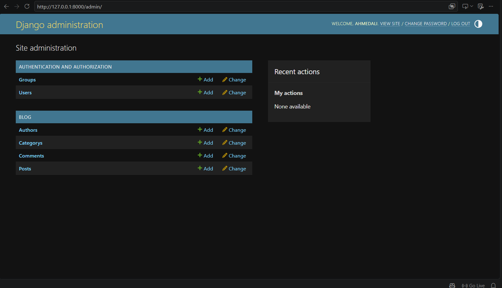
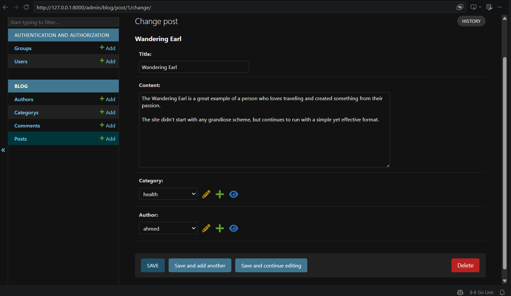
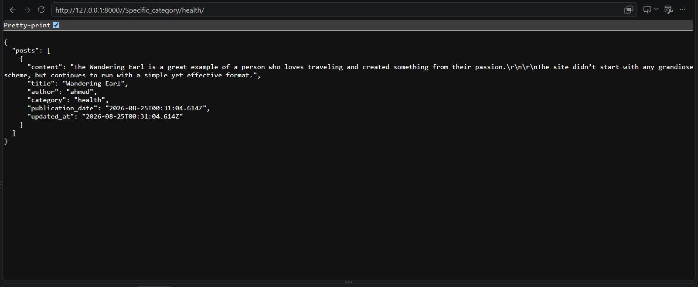
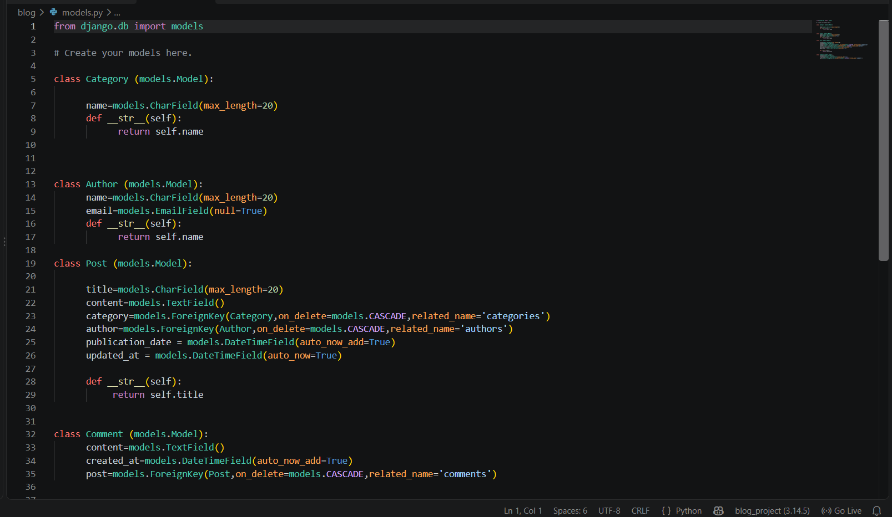

# 📝 Django Blog API

A blog backend built with **Django** that manages posts, authors, categories, and comments, and exposes the data as JSON endpoints.

## ✨ Features

- Data models for **Post**, **Author**, **Category**, and **Comment** with one-to-many relationships
- JSON endpoints to list all posts and filter by **title**, **author**, or **category**
- Create, update, and delete operations for posts
- Add, update, and delete comments on any post
- Django Admin panel to manage all content

## 🛠️ Tech Stack

- Python
- Django
- SQLite

## 🗂️ Data Models

| Model    | Fields                                                              |
|----------|---------------------------------------------------------------------|
| Category | `name`                                                              |
| Author   | `name`, `email`                                                     |
| Post     | `title`, `content`, `category` (FK), `author` (FK), `publication_date`, `updated_at` |
| Comment  | `content`, `created_at`, `post` (FK)                                |

## 🔗 API Endpoints

| Method | Endpoint                          | Description                          |
|--------|-----------------------------------|--------------------------------------|
| GET    | `/`                               | Welcome message                      |
| GET    | `/post/`                          | List all posts                       |
| GET    | `/Specifi_Post/<title>/`          | Get a single post by title           |
| GET    | `/Specific_category/<category>/`  | Get posts by category name           |
| GET    | `/Specific_Author/<author>/`      | Get posts by author name             |
| GET    | `/create/`                        | Create a sample post                 |
| GET    | `/update/`                        | Update the sample post's author      |
| GET    | `/delete/`                        | Delete the sample post               |
| GET    | `/add_comment/<post_id>/`         | Add a comment to a post              |
| GET    | `/update_comment/<post_id>/`      | Update a post's comment              |
| GET    | `/delete_comment/<post_id>/`      | Delete a post's comment              |
| GET    | `/admin/`                         | Django Admin panel                   |

### Example response: `/Specifi_Post/Rookie Moms/`

```json
{
  "content": "Rookie Moms focuses on various products...",
  "title": "Rookie Moms",
  "author": "ahmed",
  "category": "lifestyle",
  "publication_date": "2010-10-15T00:00:00Z",
  "updated_at": "2025-10-05T12:00:00Z"
}
```

## 📸 Screenshots


| Admin Panel | Edit Post | JSON API | Models |
|:-----------:|:---------:|:--------:|:------:|
|  |  |  |  |
## 🚀 Getting Started

### 1. Clone the repository

```bash
git clone https://github.com/YOUR_USERNAME/django-blog-api.git
cd django-blog-api
```

### 2. Create a virtual environment

```bash
python -m venv venv

# Windows
venv\Scripts\activate

# macOS / Linux
source venv/bin/activate
```

### 3. Install dependencies

```bash
pip install -r requirements.txt
```

### 4. Apply migrations

```bash
python manage.py migrate
```

### 5. Create an admin user

```bash
python manage.py createsuperuser
```

### 6. Run the server

```bash
python manage.py runserver
```

Open `http://127.0.0.1:8000/` in your browser, and `http://127.0.0.1:8000/admin/` for the admin panel.

## 🔮 Future Improvements

- Convert the views to **Django REST Framework** with proper GET / POST / PUT / DELETE methods
- Accept data through request bodies instead of hardcoded values
- Add authentication and permissions
- Add pagination and search
- Write unit tests

## 👤 Author

**Your Name**
- LinkedIn: https://www.linkedin.com/in/ahmed-ali-17ab763ab/
- GitHub: https://github.com/Ahmedali1910
